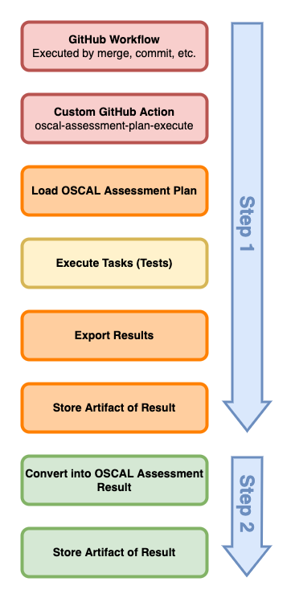
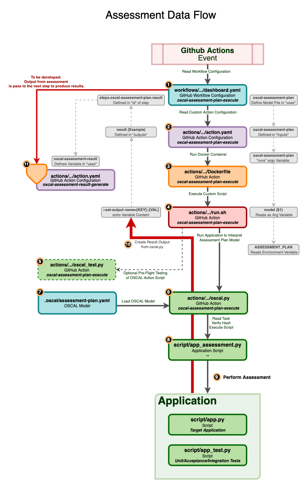

# OSCAL Assessment Workflow

Test a concept of the workflow of OSCAL using Python.

## Concept

## Sequence

## Data Flow

## Technologies

- Python
- OSCAL
- GitHub Actions

## Approach

NOTE: This repository is a very basic concept to demonstrate major steps of the workflow.  It is expected that this concept would require additional work to produce a robust, production-ready result.  The narrative below assumes a fully completed project, and does not imply that this concept is capable of performing the behavior that is described.

### GitHub Workflow

The repository should be configured to execute a workflow ([.github/workflows/dashboard.yaml](.github/workflows/dashboard.yaml)) based on some trigger.  Currently it is set to execute upon a push to the repository.  This could happen during a merge.

The workflow would execute the typical development steps on an application project such as testing and producing a build.  At some point in the process, there are two steps that would execute using custom actions.  Results from the actions are stored as artifacts as a part of the workflow execution.

### OSCAL Assessment Plan

The assesment plan is outlined in [.oscal/assessment-plan.yaml](.oscal/assessment-plan.yaml).  The example document contains a task that references a back matter resource that points to the script that performs the test ([script/app_assessment.py](script/app_assessment.py)).

There are a number of considerations for how this is implemented.  A task could execute all tests for the referenced controls, or a task could execute a test for a single control.  Additionally, this script might be included as a submodule so that another developer/team could maintain the tests separately from an application.  This might support cases where controls are tested similarly across a portfolio of applications.

The hash of the script is included in the back matter resource, and it depends on the action to verify scripts are valid before executing.  This could present security concerns if not implemented correctly.  For the concept to be operationalized, this certainly needs to be implemented more robustly in the action.

### GitHub Actions

Two custom actions are used to perform the assessment and produce results.  These actions *could* be published so that they can be used across projects, so long as a convention is implemented for finding and executing the tasks in the plan with the appropriate technologies.  This concept uses Python.

The first action, [.github/actions/oscal-assessment-plan-execute](.github/actions/oscal-assessment-plan-execute), interprets the assessment plan.  The plan location in the repository is passed as a part of the workflow.  This variable must be pass all the way into the Docker container so that it can be loaded by the assessment script.  This is documented in the data flow diagram above with light grey boxes.

The second action, [.github/actions/oscal-assessment-result-generate](.github/actions/oscal-assessment-result-generate), is expected to either receive output variables from the previous step, or to access an artifact (file) produced in the previous step.  This action would produce the assessment-result, and it could optionally produce POAM items for findings, or this could be an additional action (step) in the workflow. Technically, the first action could produce the assessment result model directly, but for now it is assumed that this would need to use a second action just to separate the functions of the code and to provide a little more flexibility regarding the workflow.

### OSCAL Assessment Result (and POAM)

This has not been implemented. (yet)
